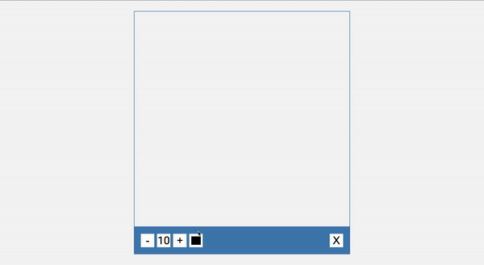

# 50 Projects in 50 Days - Drawing App

This is a code along project in the [50 Projects In 50 Days - HTML, CSS & JavaScript Udemy Course](https://www.udemy.com/course/50-projects-50-days/). Sharpen your skills by building 50 quick, unique & fun mini projects.

## Table of contents 😌

- [Overview](#overview)
  - [The project](#the-project)
  - [Screenshot](#screenshot)
  - [Links](#links)
- [My process](#my-process)
  - [Built with](#built-with)
  - [What I learned](#what-i-learned)
  - [Continued development](#continued-development)
  - [Code snippets](#im-really-proud-of-these-code-snippets%EF%B8%8F)
  - [Useful resources](#useful-resources)
- [Author](#author)
- [Acknowledgments](#acknowledgments)

## Overview👋🏾

Welcome to the 22<sup>nd</sup> mini-project of the course!

### The project😥

In this project users will be able to:

- Build a responsive site uses the canvas element to allow the user to draw with controls that allows for the option to change the color and the width of the drawing element.

### Screenshot🌇



### Links👩🏾‍💻

- Live Site URL: (https://scintillating-frangollo-6785e1.netlify.app/)

## My process💭

This is a fun project that I started by marking out initial structure, classes, and id's in HTML. Next I finalized the UI by styling the CSS. I styled both the canvas and the toolbox sections. I then added functionality by way of JavaScript by adding eventListeners to the mouseEvents. I also made the canvas element functional by first determining the mouse positions, and using these points to draw lines as the user moves the mouse.

### Built with👷🏾‍♀️

- Semantic HTML5 markup
- CSS custom properties
- Flexbox
- JavaScript

### What I learned👩🏾‍🏫

I learned about the Canvas API, and how to use it to draw graphics.

I also learned how to use mouse positions to create a drawing element.

### Continued development🔮

In the future I plan on continuing to practice positioning elements using flexbox, and using different selectors such as nth of type to select elements.

I plan on learning more of the built in API's that can be used to create amazingly dynamic webpages. 

I also plan on continuing to practice using more event listeners to make my pages more functional.

### I'm really proud of these code snippets✂️

```css
.toolbox > *:last-child {
  margin-left: auto;
}
```

```js
function drawCircle(x, y) {
    ctx.beginPath()
    ctx.arc(x, y, size, 0, Math.PI * 2)
    ctx.fillStyle = color
    ctx.fill()
}

function drawLine(x1, y1, x2, y2) {
    ctx.beginPath()
    ctx.moveTo(x1, y1)
    ctx.lineTo(x2, y2)
    ctx.strokeStyle = color
    ctx.lineWidth = size * 2
    ctx.stroke()
}
```

### Useful resources📖

- [Resource 1](https://developer.mozilla.org/en-US/docs/Web/API/Canvas_API) - This is an amazing article which details the Canvas API. I'd recommend it to anyone still learning this concept.
- [Resource 2](https://developer.mozilla.org/en-US/docs/Web/API/Canvas_API/Tutorial/Drawing_shapes) - This is an amazing tutorial which helped me learn how to draw shapes using the Canvas API.

## Author🔎

- Website - [Portfolio Site](https://maiannethornton.netlify.app/)
- Frontend Mentor - [@MaianneThornton](https://www.frontendmentor.io/profile/MaianneThornton)
- GitHub - [@MaianneThornton](GitHub.com/MaianneThornton)
- Twitter - [@MaianneThornton](https://twitter.com/MaianneThornton)
- LinkedIn - [@MaianneThornton](https://www.linkedin.com/in/maiannethornton/)

## Acknowledgments🙏🏾

Special Thanks go to [Brad Traversy](http://www.traversymedia.com/) and [Florin Pop](http://www.florin-pop.com/) creating the course and making reviewing concepts fun 😊.
